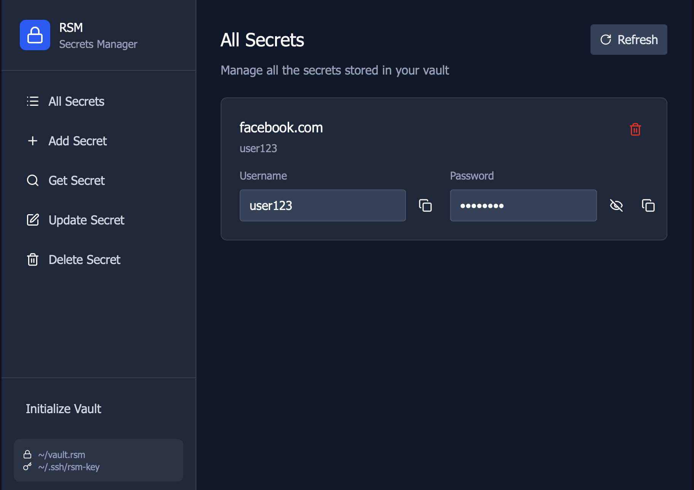
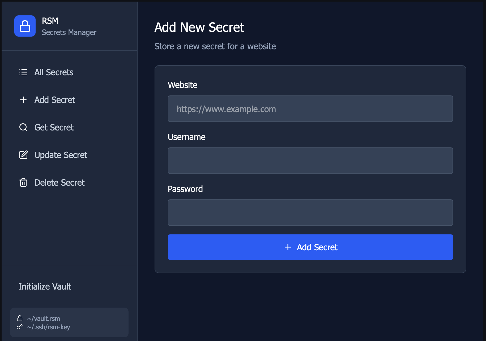
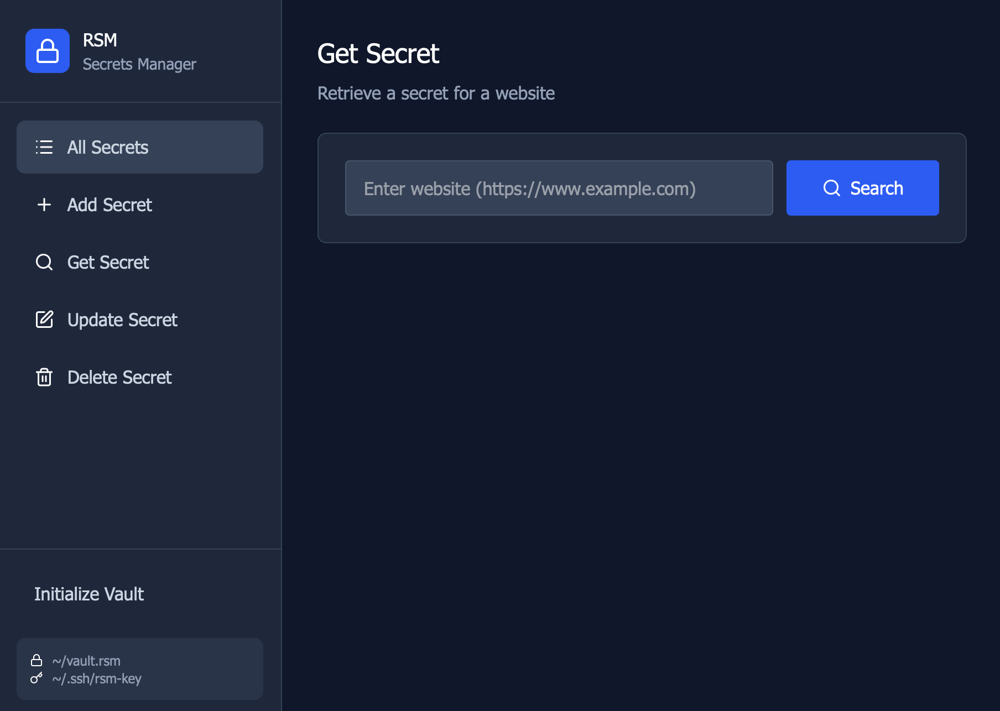
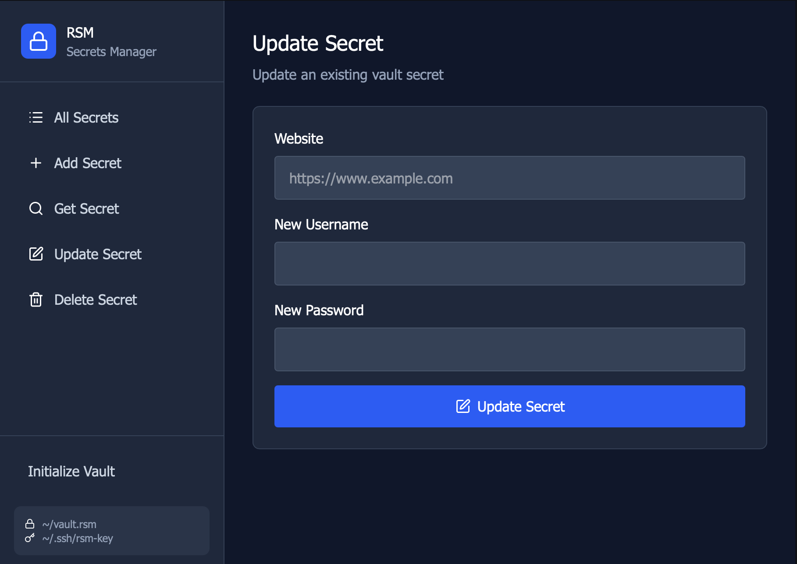
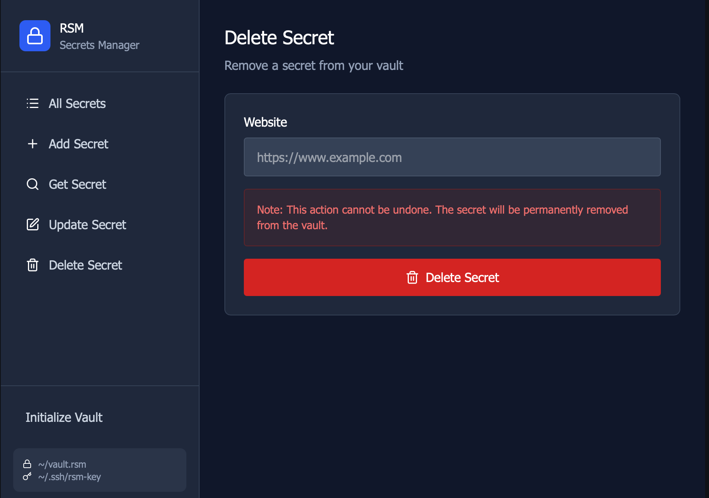

# rust-secrets-manager

rust-secrets-manager is a local secrets manager written in Rust. It provides two versions:
- a command-line interface (CLI) for scripting and terminal use
- a desktop graphical application (built with Dioxus)

**Platform support:** At this time the project is only supported and tested on macOS.

**Features**
- **AES-256 encryption:** Vault contents are encrypted at rest using AES-256.
- **Local-only storage:** All data lives on the local filesystem.

**Files & Storage**
- **Vault file:** The encrypted vault file is stored at `~/vault.rsm`.
- **Encryption key:** The key is placed in the user's .ssh folder as `~/.ssh/rsm-key`.
> Note about path configurability: The CLI currently does not prompt for a custom vault or key path; the paths above reflect the current defaults on macOS.

## CLI

The CLI lives in the `rsm-cli` crate and is suitable for automation and terminal workflows.

- Build & run (from the workspace root):

```bash
cargo install --path rsm-cli && rsm
```

Available commands:
- `rsm init` — initialize a new vault
- `rsm add <website> <username> <password>` — add a secret
- `rsm get <website>` — retrieve a secret
- `rsm update <website> <username> <password>` — update a secret
- `rsm delete <website>` — delete a secret
- `rsm list` — list all stored entries

## Desktop App (macOS)

The desktop UI lives in the `rsm-dioxus` crate and is targeted for macOS. It provides a simple GUI for viewing and managing the same vault used by the CLI.

- Build & run (from the workspace root):

```bash
cd rsm-dioxus
cargo run --release
```

## Screenshots

Preview of the desktop UI:








---